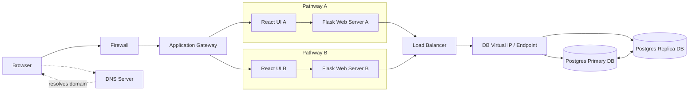
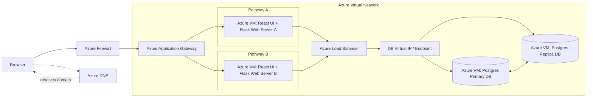
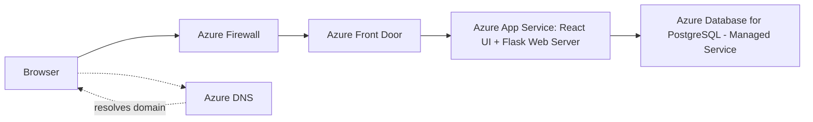

# Lab 2 – Cloud Deployment Models (IaaS vs PaaS)

## On-Premise Setup

## IAAS Setup

In an IaaS setup, the application is deployed on virtual machines within an Azure Virtual Network. Traffic is routed from the browser (via Azure DNS) through the Azure Firewall and Azure Application Gateway to VMs that host the React UI and Flask web server, managed under an Azure Load Balancer. The database layer is built on Azure VMs running PostgreSQL, configured with a primary-replica architecture accessed through a database endpoint. This model gives full control of servers and databases but requires more responsibility for patching, scaling, and maintenance.

## PAAS Setup

In a PaaS setup, the application relies on managed services instead of self-hosted VMs. Requests move from the browser (via Azure DNS) through the Azure Firewall and Azure Front Door to Azure App Service, which runs both the React UI and Flask web server without the need to manage underlying infrastructure. The backend uses Azure Database for PostgreSQL (Managed Service), which handles replication, backups, and high availability automatically. This model reduces operational overhead and lets developers focus on application functionality rather than infrastructure management.