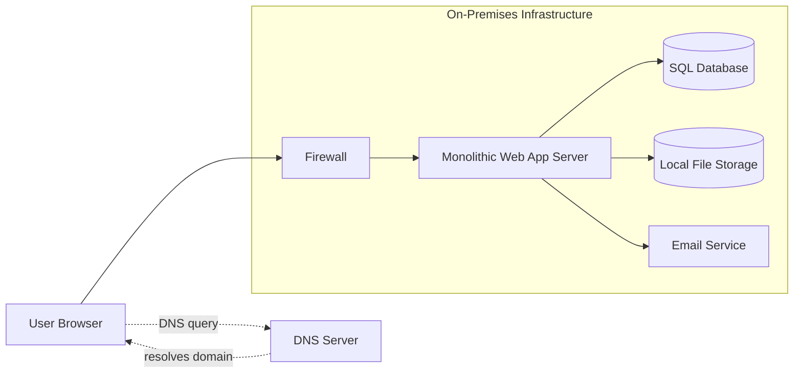

# LAB 3
# Section 1: On-Premises Solution Design 

---
### Monolithic Web Application
Runs on a physical server and handles all business logic and user interactions.  

- **Depends on:** SQL Database, File Storage, Email Service  
- **Cloud Fit:** Can be IaaS or PaaS

---

### SQL Database
Stores all application and customer data.  

- **Depended on by:** Web Application  
- **Cloud Fit:** Can be IaaS or PaaS  

---

### File Storage
Local file system used to store files and application data.  

- **Depended on by:** Web Application  
- **Cloud Fit:** Can be IaaS or PaaS 

---

### Networking (Routers & Firewalls)
Provides secure access between the internet and internal systems.  

- **Connects:** User Browser → Web Application  

---

### Email Service
Internal email server used for sending client notifications.  

- **Depended on by:** Web Application  
- **Cloud Fit:** Can be SaaS, PaaS or IaaS 

---

# Section 2: Migration Strategies

### Monolithic Web Application  
- **Choice:** **PaaS**  
- **Reason:** A PaaS is the best option because it reduces the need to manage infrastructure tasks such as updates and scaling. This means that focus of the developers can remain on making the application better rather than having to manage the servers.  
- **Migration Strategy:** Refactor  

---  

### SQL Database  
- **Choice:** **IaaS**  
- **Reason:** The database relies on custom features that are not supported in managed database services. Hosting it on IaaS ensures compatibility during the migration while still moving away from physical hardware.  
- **Migration Strategy:** Lift-and-Shift  

---  

### File Storage  
- **Choice:** **Hybrid (IaaS --> PaaS)**  
- **Reason:** Start by migrating to IaaS first to minimize application changes and reduce migration risk. We will then transition to PaaS object storage once the application has been updated to use cloud-native storage. This allows for continued use of the storage system while moving the app to cloud which makes it cheaper.  
- **Migration Strategy:** Lift-and-Shift (IaaS)  --> Phase 2 — Replatform (PaaS)
  

---  

### Networking (Routers & Firewalls)  
- **Choice:** **Cloud-Native Networking**  
- **Reason:** Physical networking equipment will be replaced with the cloud provider’s built-in networking and security tools. This approach removes the need to manage hardware while maintaining secure access.  
- **Migration Strategy:** Rebuild  

---  

### Email Service  
- **Choice:** **SaaS**  
- **Reason:** A SaaS email platform such as Office 365 or Google Workspace removes the responsibility of maintaining an on-premises mail server. This will also enable new features that were not implemented into the current mailing service such as spam filtering, calender integration, and allows for more new features that may be added by each company in the future.
- **Migration Strategy:** Replace  