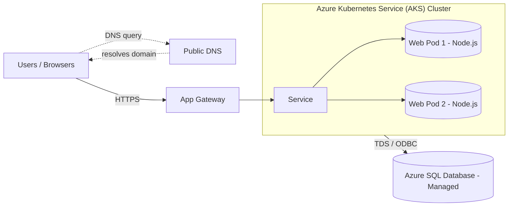

# Lab 04

## Part 1

# Part 2 — Target Architecture Description

## Core Components

### 1. Application Gateway
- Acts as the public entry point for HTTPS traffic.  
- Handles SSL/TLS termination and forwards requests to the AKS cluster.  
- Can be integrated for direct routing to Kubernetes Services.  
- Provides a built-in **Web Application Firewall (WAF)** for layer-7 protection.

### 2. Azure Kubernetes Service (AKS)
- Hosts the **containerized Node.js web application** inside a managed Kubernetes cluster.  
- Uses a **Kubernetes Service** to load-balance incoming requests across multiple **Pods**.  
- Each **Pod** runs one instance of the Node.js app container, deployed from a Docker image.  
- AKS manages **scaling, health monitoring, and self-healing** for the application.  
- Typical setup includes:
  - 2+ **Pods** for load balancing and redundancy.
  - 1 or more **Node Pools** distributed across **Availability Zones**.
  - **ConfigMaps** for environment variables and **Secrets** stored securely in **Azure Key Vault**.

### 3. Managed Database
- The data tier uses **Azure SQL Database**, a **fully managed PaaS service**.  
- Provides **automatic backups**, **high availability**, and **point-in-time restore (PITR)**.  
- The connection from AKS to SQL Database uses **TDS / ODBC protocols** over a **private endpoint** for secure communication.

---

## Scalability and High Availability
- **Multiple Pods** and **load-balanced Services** ensure continuous availability.  
- **Horizontal Pod Autoscaler (HPA)** automatically adds or removes pods based on CPU or memory usage.  
- **Cluster Autoscaler** adjusts the number of AKS nodes as workloads grow or shrink.  
- **Rolling updates** allow new versions to deploy with minimal downtime.  
- **Availability Zones** protect against data center-level outages.

---

## Security and Networking
- All external traffic uses **HTTPS** via the Application Gateway.  
- **Network Security Groups (NSGs)** restrict access between subnet layers.  
- **Azure Key Vault** stores credentials, certificates, and connection strings securely.  
- **Managed Identities** and **Azure AD RBAC** control access between AKS, ACR, and SQL.  
- **Private Endpoint** ensures the database is not publicly accessible.

---

## Part 3 — Migration Plan

### 1) Prepare
- First step is to create resources in Azure.
- Decide the app’s public name and obtain an SSL/TLS certificate.
- Enable basic monitoring so errors and traffic are visible.
- Take backups of **WebServerVM** and **SQLVM**.

### 2) Containerize the App
- Package the Node.js app into a Docker image.
- Use environment variables for configuration.
- Run the image locally and verify a health check passes.

### 3) Set Up Cloud Pieces
- AKS Cluster: create a small cluster with 2–3 nodes.
- App Gateway Ingress: set up the public HTTPS entry point.
- Kubernetes objects: create Deployment, Service, and Ingress.
- Azure SQL Database: create a managed database and choose an initial size and tier.
- Store secrets and the database connection string in Key Vault or Kubernetes secrets.

### 4) Test in the Cloud Before Cutover
- Deploy the image to AKS.
- Point the app to Azure SQL using test data.
- Open the test URL and try key pages such as home and login, including a simple write and read.
- If results are good, continue to switch real traffic.

### 5) Cutover Day
1. Pause writes on the old site by placing it in maintenance or read-only mode.
2. Move data to Azure SQL with a final synchronization or backup and restore.
3. Update the app’s connection string to point to Azure SQL.
4. Point traffic to AKS:
   - Either change the App Gateway backend to the AKS Service
   - Or update DNS to the new front door if the hostname changes
5. Run quick checks: key pages load, errors are low, and data is correct.

### 6) After the Switch
- Monitor logs and metrics for an hour; if stable, the cutover is complete.
- Keep the old VMs powered off but available for a few days, then remove them.
- Capture next steps such as scaling limits, alerts, and a CI/CD pipeline.
