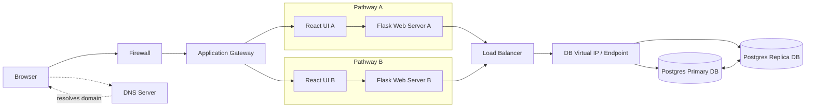
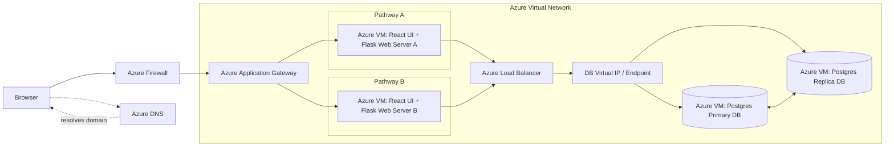
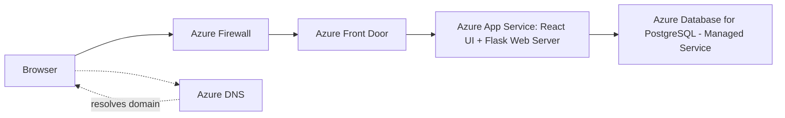

### title

```mermaid
flowchart LR
  %% On-Premise Setup (realistic DNS placement)

  B[Browser] --> FW[Firewall] --> AGW[Application Gateway]

  %% DNS side query
  B -.-> DNS[DNS Server]
  DNS -. resolves domain .-> B

  %% Two identical app pathways
  subgraph pathA[Pathway A]
    direction TB
    UIA[React UI A] --> WSA[Flask Web Server A]
  end

  subgraph pathB[Pathway B]
    direction TB
    UIB[React UI B] --> WSB[Flask Web Server B]
  end

  AGW --> UIA
  AGW --> UIB

  %% Load Balancer distributes across app servers
  WSA --> LB[Load Balancer]
  WSB --> LB

  %% Database setup with primary/replica and replication
  LB --> DBVIP[DB Virtual IP / Endpoint]
  DBVIP --> DB1[(Postgres Primary DB)]
  DBVIP --> DB2[(Postgres Replica DB)]
  DB1 <--> DB2
```

```mermaid

flowchart LR
  %% IaaS Deployment (Azure Virtual Network with Azure-specific components)

  B[Browser] --> FW[Azure Firewall] --> AGW[Azure Application Gateway]

  %% DNS side query
  B -.-> DNS[Azure DNS]
  DNS -. resolves domain .-> B

  %% Azure Virtual Network grouping
  subgraph VNET[Azure Virtual Network]
    AGW

    %% Two VM pathways
    subgraph pathA[Pathway A]
      direction TB
      VMA[Azure VM: React UI + Flask Web Server A]
    end

    subgraph pathB[Pathway B]
      direction TB
      VMB[Azure VM: React UI + Flask Web Server B]
    end

    AGW --> VMA
    AGW --> VMB

    %% Load Balancer
    VMA --> LB[Azure Load Balancer]
    VMB --> LB

    %% Database setup on VMs
    LB --> DBVIP[DB Virtual IP / Endpoint]
    DBVIP --> DB1[(Azure VM: Postgres Primary DB)]
    DBVIP --> DB2[(Azure VM: Postgres Replica DB)]
    DB1 <--> DB2
  end

```

```mermaid
flowchart LR
  %% PaaS Deployment (Azure)

  B[Browser] --> FW[Azure Firewall] --> AFD[Azure Front Door]

  %% DNS side query
  B -.-> DNS[Azure DNS]
  DNS -. resolves domain .-> B

  %% Azure App Service hosting React + Flask
  AFD --> AppSvc[Azure App Service: React UI + Flask Web Server]

  %% Managed database 
  AppSvc --> DB[Azure Database for PostgreSQL - Managed Service]


```